<div align="center">

# NeuraFleet

**A cloud-native robot-fleet command center: live telemetry, a real-time 3D LiDAR viewer and a RAG assistant, built as four microservices and deployable to GKE.**

[](https://github.com/MinhalShafiq/NeuraFleet/actions/workflows/ci.yml)


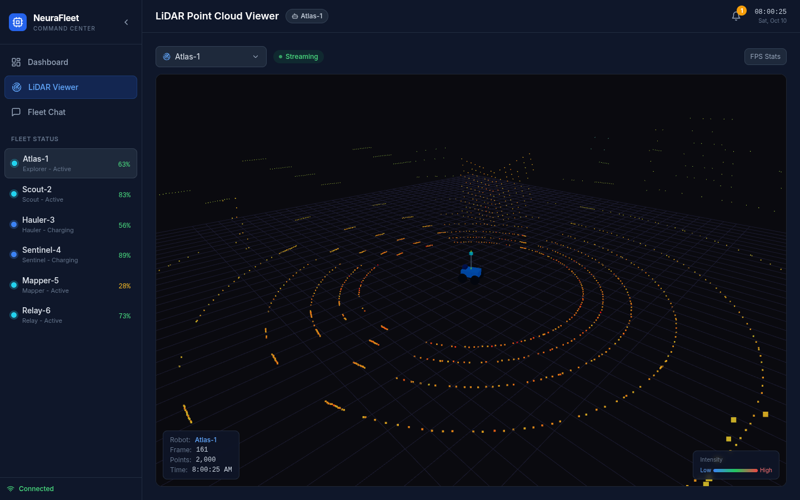

<sub>The LiDAR viewer streaming a live 2,000-point scan at 5 Hz. The rover at the centre is Atlas-1; the rings are the sensor's 16 laser channels.</sub>

</div>

---

## What it is

Six simulated robots (explorer, scout, hauler, sentinel, mapper, relay) roam a 100 m arena. NeuraFleet simulates them,
streams their data to a browser dashboard, raises alerts when something looks wrong, and lets you ask questions about
the fleet in plain English.

- **Live fleet dashboard.** Battery, position, temperature, CPU and memory for every robot, updating twice a second.
- **3D LiDAR viewer.** A vectorised 16-channel LiDAR simulation (ray casting against boxes, cylinders and walls) streams
  ~2,000 points per frame at 5 Hz into a three.js scene, with a model of each robot at the sensor.
- **Stateful alerts.** Raised once, updated in place, and cleared with hysteresis, so the list never flickers.
- **RAG chat assistant.** Retrieval over the robot manuals in ChromaDB. Uses Claude when `ANTHROPIC_API_KEY` is set and a
  rule-based fallback when it isn't, so it works with no key at all.
- **Honest about failure.** When a service dies, the dashboard keeps working on clearly-labelled demo data and recovers
  by itself when the service returns.

<table>
<tr>
<td width="50%">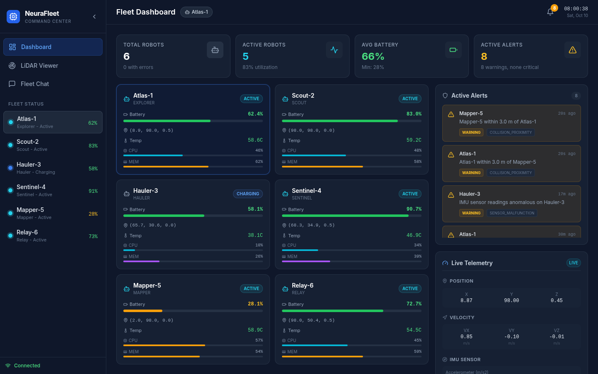<br><sub><b>Fleet dashboard</b>: robot cards, summary tiles, stateful alerts and live telemetry</sub></td>
<td width="50%">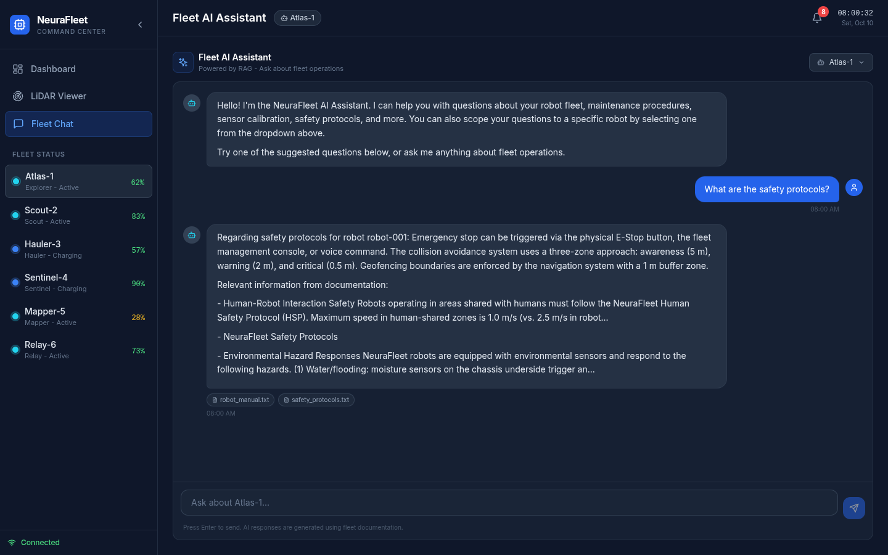<br><sub><b>Fleet assistant</b>: answers built from the documentation, with source chips</sub></td>
</tr>
</table>

## Architecture

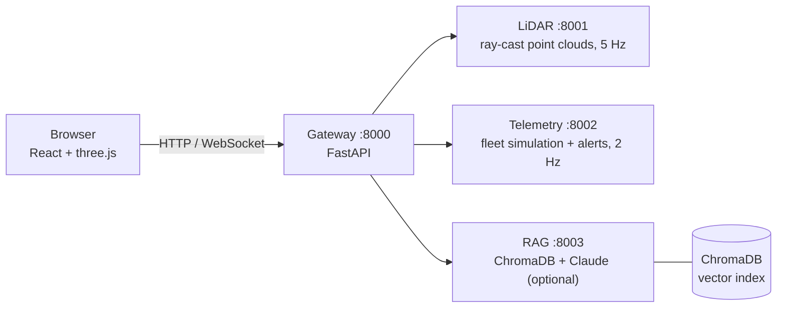

| Service | Role |
|---|---|
| **Gateway** | The single public entry point. Proxies HTTP and WebSockets; serves flagged demo data if a service is down. |
| **LiDAR** | Vectorised 16-channel LiDAR simulation, motion compensation, one shared 5 Hz stream per robot. |
| **Telemetry** | Seeded multi-robot simulation and stateful alerting (raise once, update, clear with hysteresis). |
| **RAG** | Retrieval over the robot docs in ChromaDB, answered by Claude or a rule-based fallback. |
| **Dashboard** | React 18 + Vite + Tailwind, with a react-three-fiber point-cloud viewer, served by unprivileged nginx. |

The six robots, each with its own model in the viewer:

<table>
<tr>
<td align="center" width="33%">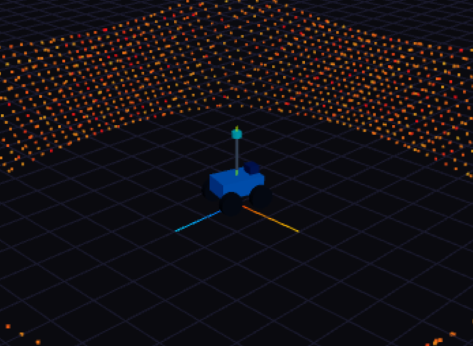<br><sub><b>Atlas-1</b> · explorer</sub></td>
<td align="center" width="33%">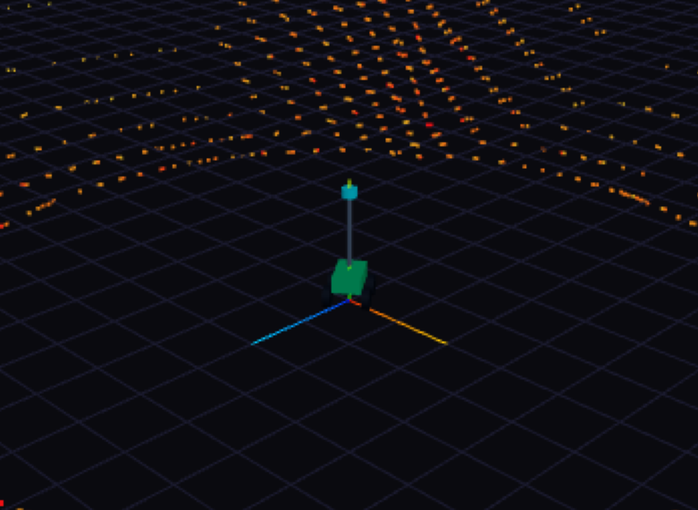<br><sub><b>Scout-2</b> · scout</sub></td>
<td align="center" width="33%">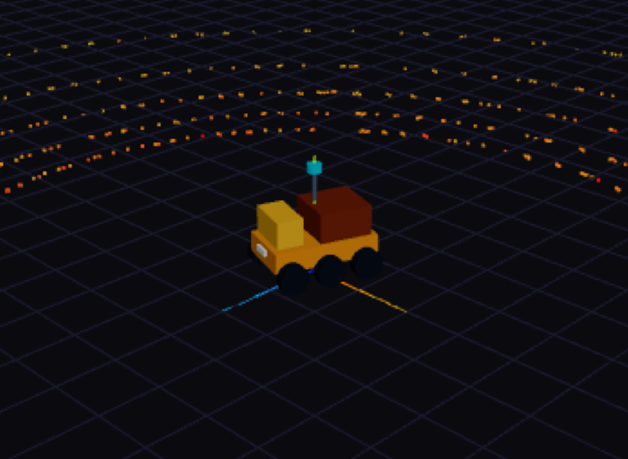<br><sub><b>Hauler-3</b> · hauler</sub></td>
</tr>
<tr>
<td align="center">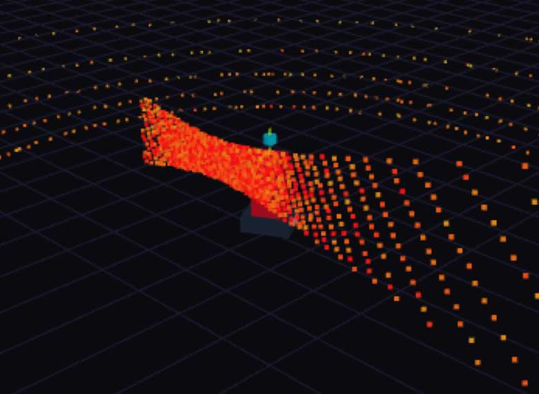<br><sub><b>Sentinel-4</b> · sentinel</sub></td>
<td align="center">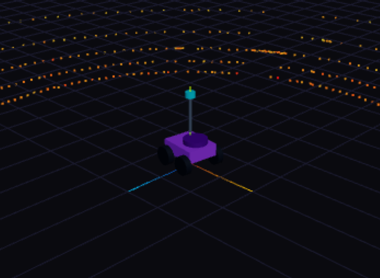<br><sub><b>Mapper-5</b> · mapper</sub></td>
<td align="center">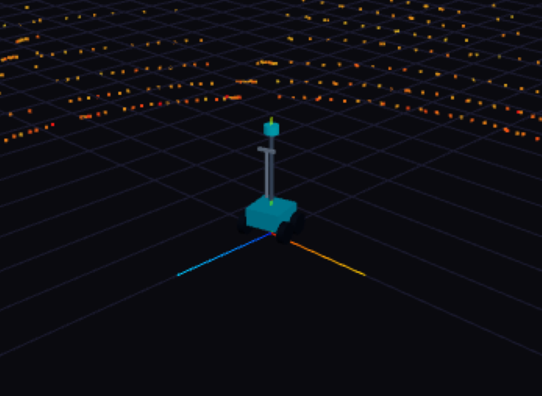<br><sub><b>Relay-6</b> · relay</sub></td>
</tr>
</table>

---

## Run it

You need **Docker with Compose v2** and free ports **3000** and **8000–8003**. No API key is required.
(Not in the `docker` group yet? `sudo usermod -aG docker $USER`, then log out and back in.)

### 1. Start the stack

```bash
git clone https://github.com/MinhalShafiq/NeuraFleet.git && cd NeuraFleet
cp .env.example .env              # ANTHROPIC_API_KEY is optional
docker compose up --build -d
```

The first build downloads Python packages and an ~80 MB embedding model, so allow a few minutes. Later starts take seconds.

### 2. Wait until everything is healthy

```bash
docker compose ps
```

All five containers should say `(healthy)`. The RAG service is last, because it indexes the docs on first start.
Then confirm the backend is **live** and not serving fallback data:

```bash
curl -s localhost:8000/api/health
# {"status":"ok","services":{"telemetry":"healthy","lidar":"healthy","rag":"healthy"},
#  "mode":{"telemetry":"live","lidar":"live","rag":"live"}}
```

Every `mode` must say `live`. `mock` means the gateway is generating data because a service is unreachable.

### 3. Open the dashboard: <http://localhost:3000>

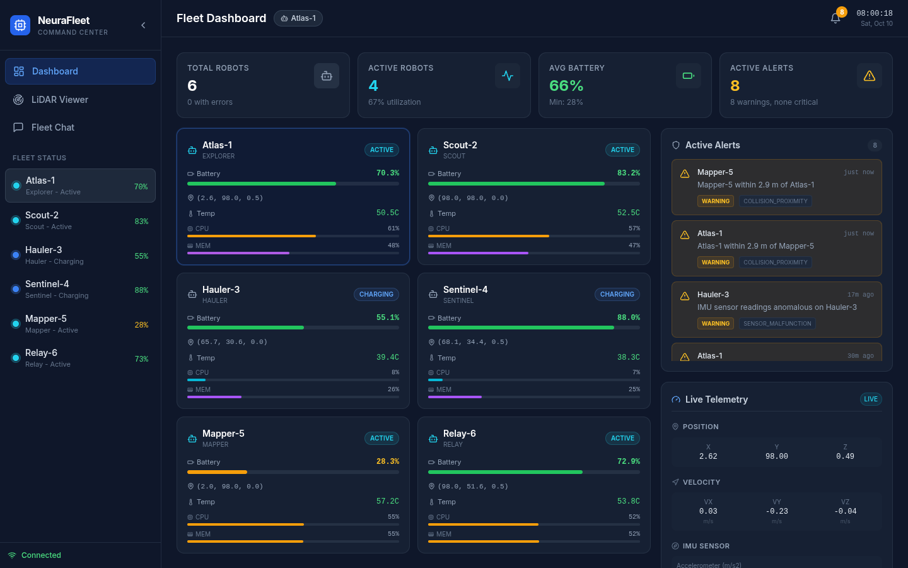

You should see six robot cards updating twice a second, four summary tiles, the alert list, and a green **Connected**
indicator bottom-left. Click a robot to open its **Live Telemetry** panel (position, velocity, IMU, GPS), which keeps updating.
There is **no** amber DEMO DATA badge while all services are up.

### 4. Open the LiDAR viewer

Click **LiDAR Viewer** in the sidebar and give it a couple of seconds.

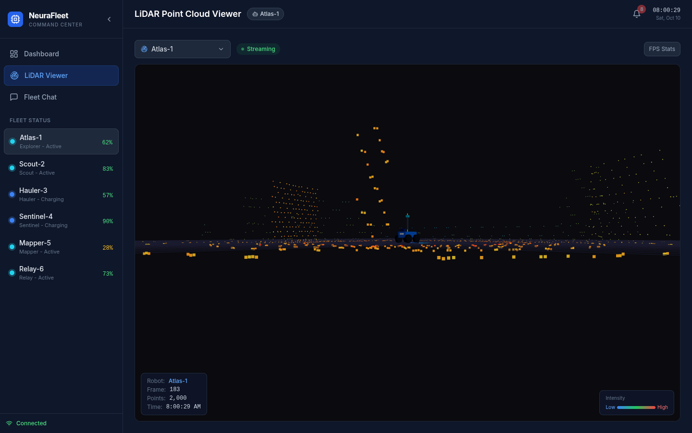

- **Streaming** (green) and a frame counter climbing at about 5 per second, with 2,000 points per frame.
- The rings on the ground are the sensor's 16 laser channels. The dense block standing up is a building. **Red is a strong, near
  return; blue is weak and far.**
- The robot's model sits at the centre, facing where it drives, with a cyan sensor puck on a mast.
- **Drag** to orbit, **scroll** to zoom, **right-drag** to pan. Pick another robot from the dropdown to see its model.

### 5. Ask the assistant

Click **Fleet Chat**, choose a suggested question such as *"What are the safety protocols?"* and press Enter.
You get an answer plus source chips (`safety_protocols.txt`, …) naming the documents it came from.

### 6. Break it on purpose

With the dashboard open, stop a service:

```bash
docker compose stop telemetry-service
```

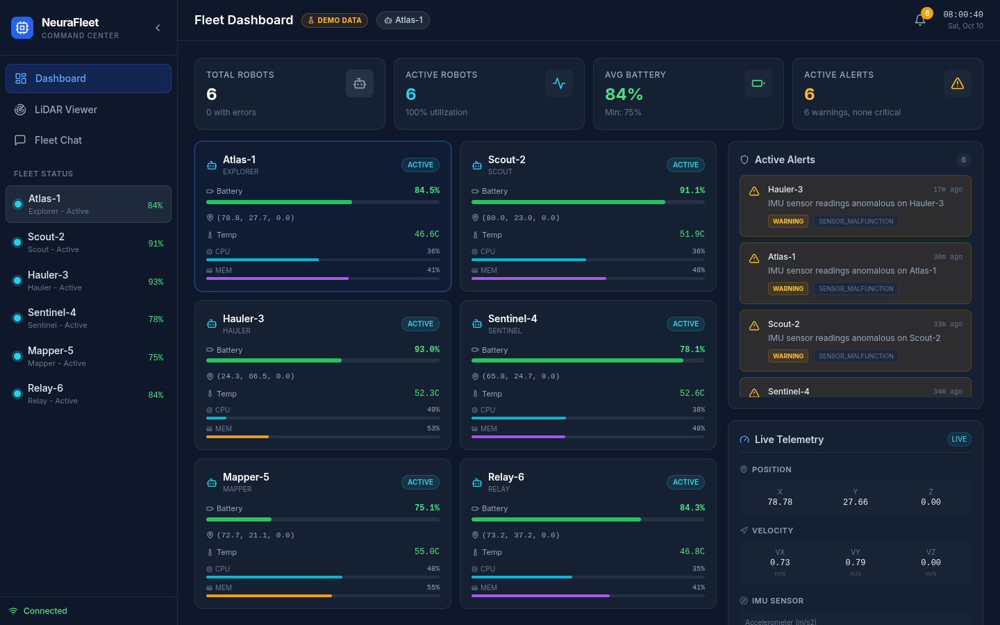

An amber **DEMO DATA** badge appears within seconds. The robots keep moving, but the numbers are now generated by the gateway
and honestly labelled, and `/api/health` reports `"telemetry":"mock"`. Bring it back:

```bash
docker compose start telemetry-service
```

Within about 10–30 seconds the badge clears **by itself**, with no page reload. Try the same with `lidar-service`,
`rag-service` and `gateway`.

<table>
<tr>
<td width="33%">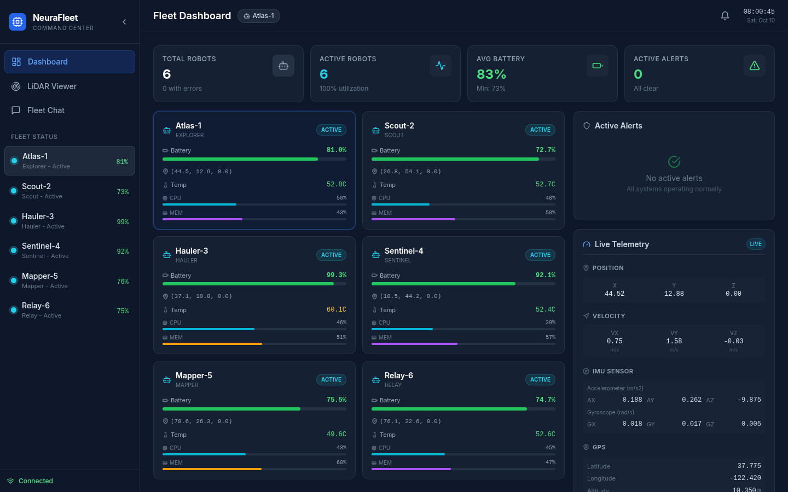<br><sub>Recovered: badge cleared, live again</sub></td>
<td width="33%">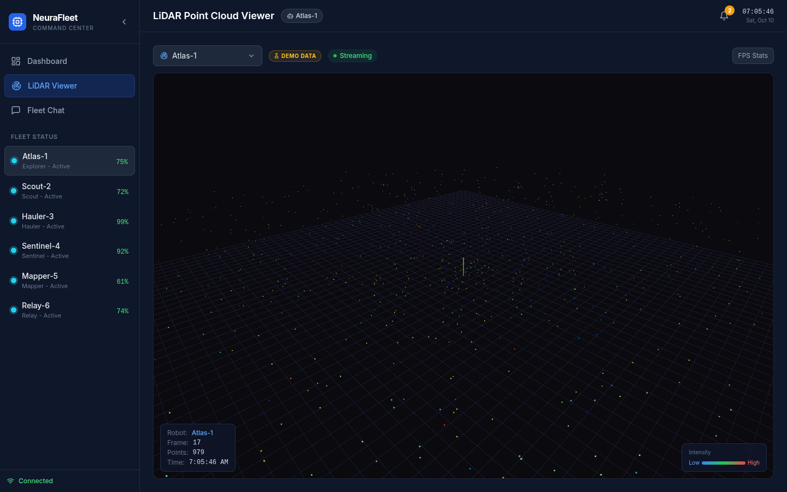<br><sub>LiDAR service down: demo point cloud</sub></td>
<td width="33%">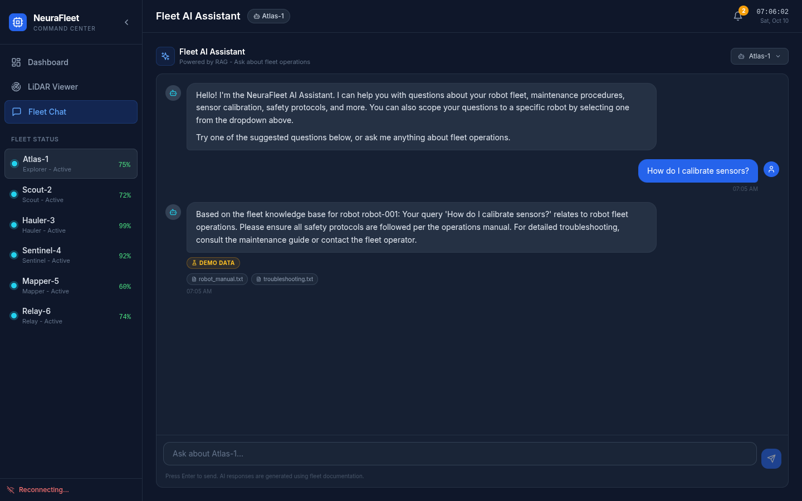<br><sub>Gateway down: reconnecting with backoff</sub></td>
</tr>
</table>

### Stop

```bash
docker compose down        # add -v to also delete the stored document index
```

<details>
<summary><b>Run without Docker</b></summary>

Services import the shared contract as `shared.*`, so put `backend/` on the path and install from the lockfiles:

```bash
python3.11 -m venv .venv && . .venv/bin/activate
pip install -r backend/gateway/requirements.lock -r backend/lidar_service/requirements.lock \
            -r backend/telemetry_service/requirements.lock -r backend/rag_service/requirements.lock

export PYTHONPATH=$PWD/backend LOG_FORMAT=text
(cd backend/telemetry_service && uvicorn main:app --port 8002) &
(cd backend/lidar_service     && uvicorn main:app --port 8001) &
(cd backend/rag_service       && uvicorn main:app --port 8003) &
(cd backend/gateway && LIDAR_SERVICE_URL=http://localhost:8001 TELEMETRY_SERVICE_URL=http://localhost:8002 \
   RAG_SERVICE_URL=http://localhost:8003 uvicorn main:app --port 8000)

cd frontend/dashboard && npm ci && npm run dev      # proxies /api to :8000
```
</details>

<details>
<summary><b>Troubleshooting</b></summary>

| Symptom | Fix |
|---|---|
| 3D viewer is a black box | WebGL is off in your browser. Enable hardware acceleration or try another browser (`chrome://gpu`). |
| Amber DEMO DATA right after start | A container is still starting. Wait for `docker compose ps` to show everything `(healthy)`. |
| "Reconnecting…" in the sidebar | The gateway is down or restarting: `docker compose logs gateway`. |
| Port already in use | `docker compose down` (an old stack), or `ss -ltnp \| grep :3000`. |
| First start looks stuck | RAG indexes the docs on first start (up to a minute): `docker compose logs -f rag-service`. |
</details>

---

## Engineering highlights

| | |
|---|---|
| **Fast simulation** | Ray casting is fully vectorised in NumPy: one 14,400-ray scan went from **349 ms to 10 ms (34×)**. The frame payload shrank from 159 KB to 62 KB by rounding to float64 and disabling per-message deflate on the internal hop. |
| **One API contract** | `backend/shared/models.py` defines every payload. Services use it as `response_model`, so responses are validated and `/docs` is accurate. A malformed upstream response becomes a `502`, an unknown robot a `404`. |
| **Outages are visible** | Fallback payloads carry `"demo": true`; the UI shows a DEMO DATA badge; `/api/health` reports `live` or `mock` per service; `gateway_mock_fallback_total` counts it. A dropped WebSocket keeps streaming demo frames and switches back on its own. |
| **Observable** | One JSON log line per event with a `request_id` forwarded across services; Prometheus metrics at `/metrics` on every service. |
| **Efficient rendering** | The point cloud writes into preallocated GPU buffers and moves a draw range, so nothing is reallocated per frame. React state is memoised and chart history commits at 1 Hz. WebSockets reconnect with jittered exponential backoff. |
| **Tested for real** | 136 pytest + 23 Vitest tests, plus an end-to-end runner and a **real-browser tour** that screenshots every screen and counts changed canvas pixels to prove the point cloud is actually drawn. |
| **Production-minded infra** | Multi-stage Docker builds from pinned lockfiles, non-root and read-only root filesystems, a private GKE cluster with required `authorized_cidrs`, kustomize image tags (never `:latest`), and a 1 h load-balancer timeout for the WebSocket streams. |

<details>
<summary><b>Behaviour notes</b></summary>

- **Simulators are single-instance.** Telemetry and LiDAR keep their world in memory, so each runs one worker and one replica.
  Scaling them out means moving that state out of the process first.
- **`/health` vs `/api/health`.** `/health` never calls downstream and is the Kubernetes probe; `/api/health` is the observability view.
- **`/metrics` and `/docs`** share the API's port, so restrict them at the ingress if the gateway is public.
- **LiDAR and telemetry positions are independent.** They share robot ids, not coordinates.
</details>

---

## Test

```bash
scripts/test.sh --unit      # pytest + ruff + mypy (no Docker or Node needed)
scripts/test.sh             # + frontend lint/tests/build + the running Docker stack
scripts/test.sh --up        # same, building and starting the stack first
scripts/test.sh --browser   # + a real headless-Chrome tour of the dashboard
```

The stack checks cover health, status codes, alert stability, Chroma persistence across a restart, three concurrent LiDAR
viewers at 5 Hz, request-ID propagation, and a chaos step that stops the telemetry service to confirm the dashboard is told it
is looking at demo data and recovers (`--no-chaos`, `--no-restart`, `--no-load` skip steps). `pre-commit install` runs the
linters on commit.

The browser tour lives in `scripts/walkthrough/` and regenerates the screenshots above:

```bash
cd scripts/walkthrough && npm install     # uses your installed Chrome; downloads no browser
node walk.mjs all                         # writes assets/screenshots/
```

## Dependencies

Edit `backend/<service>/requirements.txt`, then regenerate its lock (images and CI install from it):

```bash
uv pip compile backend/<service>/requirements.txt -o backend/<service>/requirements.lock \
  --python-version 3.11 --python-platform linux
```

A test fails if a lock disagrees with its requirements or with another service's lock.

## Deploy (GCP)

<details>
<summary><b>Terraform and Kubernetes</b></summary>

**Terraform** provisions the network, a private GKE cluster and a Cloud NAT. Who may reach the control plane is a **required**
input with no default (`0.0.0.0/0` is rejected). No GPU pool is created.

```bash
echo 'authorized_cidrs = [{ cidr_block = "203.0.113.7/32", display_name = "office" }]' \
  > terraform/environments/dev.local.tfvars                    # untracked
cd terraform && terraform init
terraform apply -var-file=environments/dev.tfvars -var-file=environments/dev.local.tfvars
```

**Kubernetes.** The API key never goes in git; create the secret by hand (RAG falls back to rule-based answers without it).
Images use immutable tags injected by kustomize, never `:latest`; applying with the placeholder tag fails loudly with
`ImagePullBackOff`.

```bash
kubectl apply -f k8s/namespace.yaml
kubectl -n neurafleet create secret generic neurafleet-secrets --from-literal=ANTHROPIC_API_KEY="$ANTHROPIC_API_KEY"

cd k8s
for s in gateway telemetry-service lidar-service rag-service frontend; do
  kustomize edit set image gcr.io/PROJECT_ID/neurafleet-$s=gcr.io/<your-project>/neurafleet-$s:$(git rev-parse --short HEAD)
done
kubectl apply -k .
```

`k8s/backendconfig.yaml` raises the load balancer timeout to 1 h; without it GCE closes the WebSocket streams after 30 s.
</details>

## Project layout

```
backend/{gateway,lidar_service,telemetry_service,rag_service}   one FastAPI service each (+ Dockerfile, lock)
backend/shared/                                                 API contract + logging/metrics
frontend/dashboard/                                             React app (Vite, Tailwind, Vitest)
k8s/   terraform/   docker-compose.yml                          deployment
tests/   scripts/test.sh   scripts/walkthrough/                 pytest suite, end-to-end runner, browser tour
assets/screenshots/                                             the images in this README
```

## The fleet

| ID | Name | Type | | ID | Name | Type |
|---|---|---|---|---|---|---|
| robot-001 | Atlas-1 | explorer | | robot-004 | Sentinel-4 | sentinel |
| robot-002 | Scout-2 | scout | | robot-005 | Mapper-5 | mapper |
| robot-003 | Hauler-3 | hauler | | robot-006 | Relay-6 | relay |
